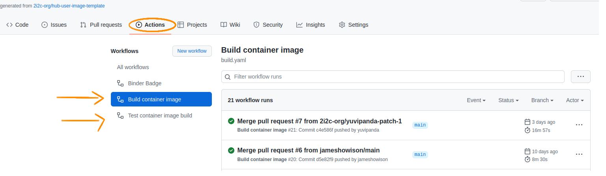
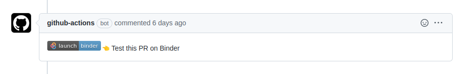

# user image for meom-ige hub

## In-depth guide

Checkout the 2i2c docs for an in-depth guide on how to use this template repository to create a custom user image and use it for your hub :arrow_right: https://docs.2i2c.org/en/latest/admin/howto/environment/hub-user-image-template-guide.html.

## About this template repository :information_source:

This template repository enables [jupyterhub/repo2docker-action](https://github.com/jupyterhub/repo2docker-action).
This GitHub action builds a Docker image using the contents of this repo and pushes it to the [Quay.io](https://quay.io/) registry.

### The GitHub workflows

This template repository provides two GitHub workflows that can build and push the image to quay.io when configured.

#### 1. Build and push container image :arrow_right: [build.yaml](https://github.com/2i2c-org/hub-user-image-template/blob/main/.github/workflows/build.yaml)

This workflow is triggered by every pushed commit on the main branch of the repo (including when a PR is merged).
It **builds** the image and **pushes** it to the registry.

#### 2. Test container image build :arrow_right: [test.yaml](https://github.com/2i2c-org/hub-user-image-template/blob/MAIN/.github/workflows/test.yaml)

This workflow is triggerd by every Pull Request commit and it **builds** the image, but it **doesn't** push it to the registry, unless explicitly configured to do so. Checkout [this section](#enable-quayio-image-push-for-testyaml) on how to enable image pushes on Pull Requests.

#### 3. Test this PR on Binder Badge :arrow_right: [binder.yaml](https://github.com/2i2c-org/hub-user-image-template/blob/MAIN/.github/workflows/binder.yaml)

This workflow posts a comment inside a pull request, every time a pull request gets opened. The comment contains a "Test this PR on Binder" badge, which can be used to access the image defined by the PR in [mybinder.org](https://mybinder.org/).

